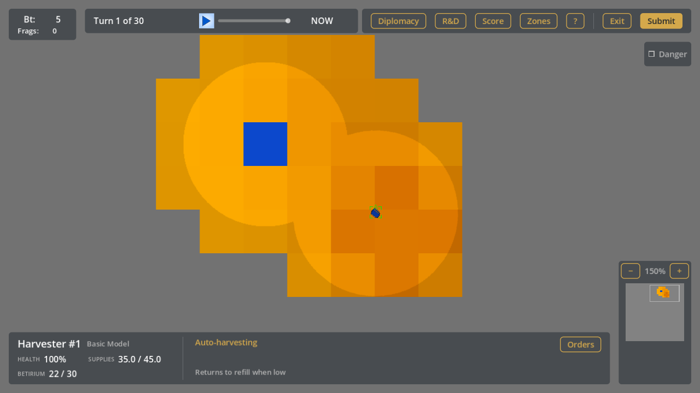
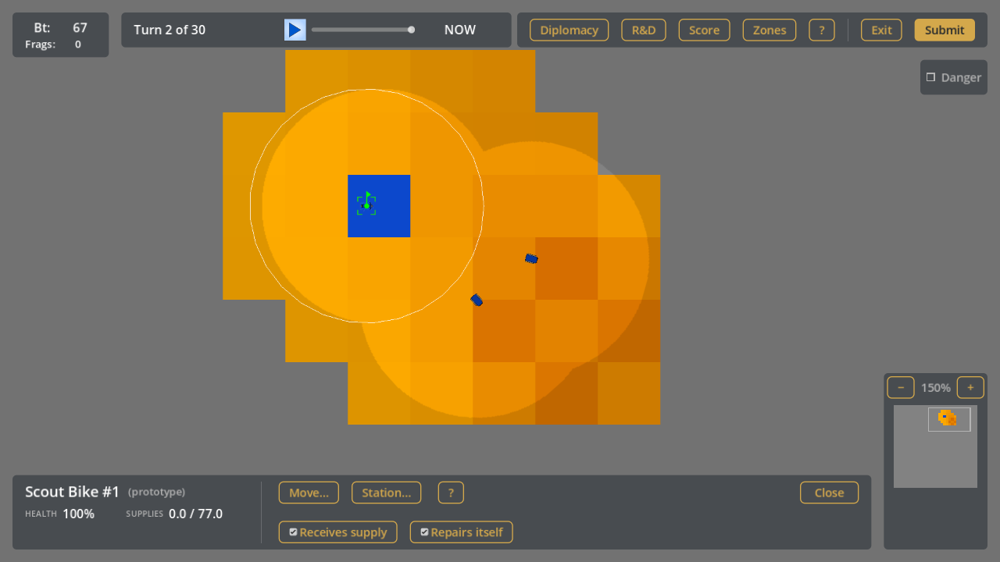
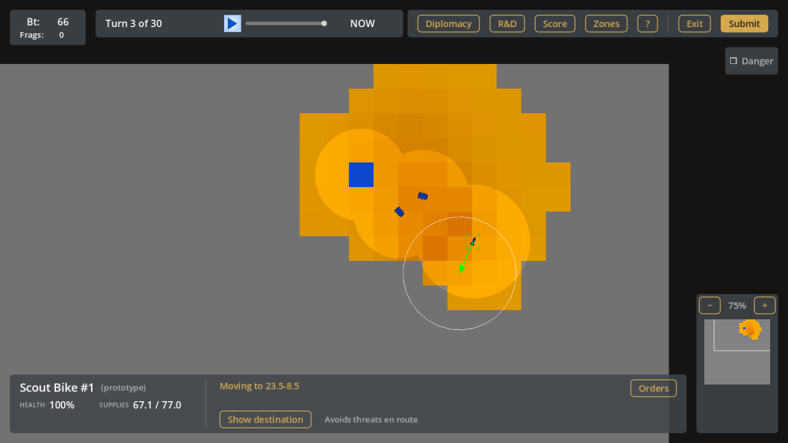
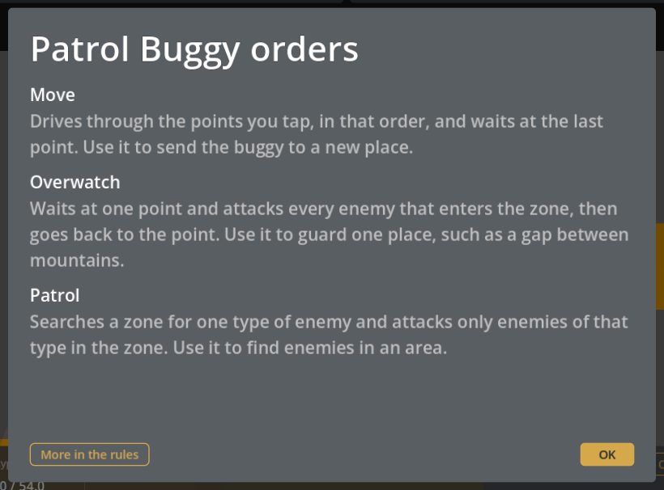
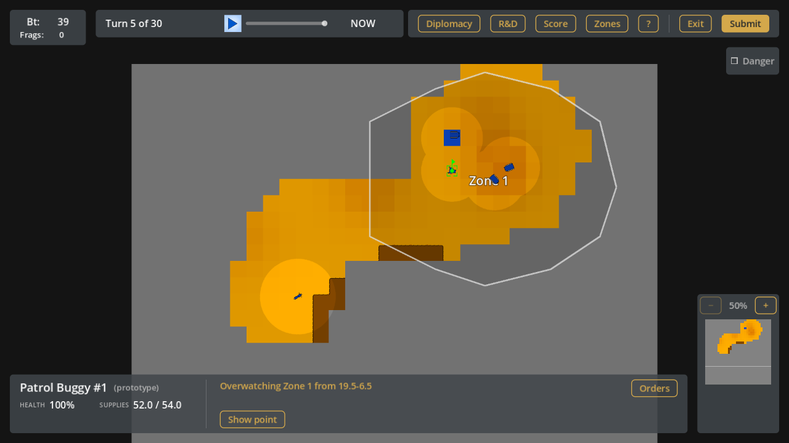
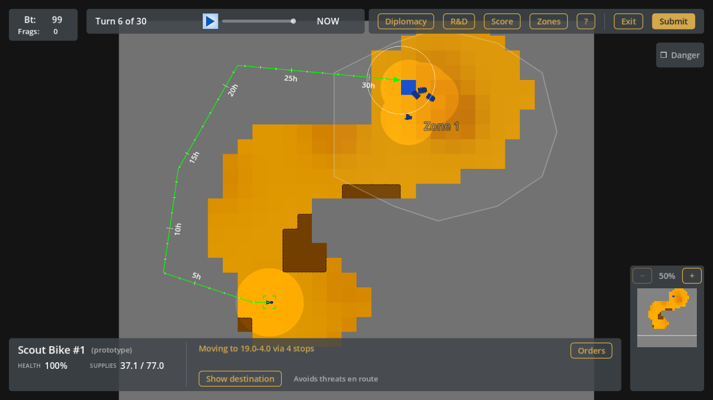

# Your First Five Turns

This guide describes one sound opening, turn by turn. It follows one example
game and shows what the player does and why. Your game will differ in the
details, such as the map and the amounts of Betirium. The reasons stay the
same. The [rules](README.md) explain every term in full.

## The Ideas Behind The Opening

- **Scout around your base.** Betirium lies in the ground, in groups of
  neighboring cells that hold a lot of it. The group near your base is the
  home field. Sometimes a second, poorer group lies near the base too.
  Harvesters on Auto-Harvest pick the best cells among the cells that you have
  uncovered. If the home field is not uncovered yet, they may dig the poorer
  group, and your income stays low. A Scout Bike uncovers the home field.
- **Get at least one combat unit.** It defends your base against raids.
- **Learn the wider geography.** You see where enemies can attack you from,
  and whom you can attack. Fog of war hides units: ground that you uncovered
  stays on your map, but you see the units on it only while one of your units
  looks at that place.
- **Build a new Harvester as soon as you have 90 Betirium.** Each Harvester
  makes your income grow faster.
- **Spend no Betirium on anything that delays the next Harvester.**
- **Build a unit only when you need it.** A unit that works uses supplies.
  Supplies cost Betirium: when a unit refills at your base, Betirium is
  turned into supplies. In a usual game, 1 kg of Betirium makes 15 supplies.
  A unit uses 1 supply for each hour that it moves. So a Scout Bike that
  drives for 10 hours uses 10 supplies, which is about 0.7 kg of Betirium.

Your income has two parts. The game gives you 5 Betirium for free at the
start of every turn. Your Harvesters add the Betirium that they dig and carry
to the base.

## Turn 1: Look At The Base

The player has 2 Harvesters and 5 Betirium, the free amount of turn 1. The
Harvesters already work, because Auto-Harvest is the order that every new
Harvester has.

The player cannot afford a unit and does not need one. Engineering does
research instead: the player works on the **Scout Bike** project. This is the
first step of the scouting idea. See [Engineering](README.md#engineering).

## Turn 2: The Scout Bike Circles The Base

The player has 67 Betirium: the free 5 and the load that the Harvesters
brought. When a design is complete, the game gives one free unit, the
prototype. So a Scout Bike arrived at the base.

The player gives the bike a **Move** order with a route that loops around the
base. The bike is fast and sees about twice as far as most units. Its route
shows the Harvesters the ground near the base. See
[Scout Bike](README.md#scout-bike).

Engineering starts a brainstorm, which finds a new project. See
[Brainstorming](README.md#brainstorming).

The player builds nothing. A Harvester costs 90 Betirium, and the player has
67.

## Turn 3: The Loop Ends

The player has 66 Betirium, one less than last turn, although the free 5
arrived and the Harvesters brought more. The reason: units refilled at the
base. The new Scout Bike left with an empty tank, and the Harvesters topped up
theirs. Betirium was turned into their supplies. The bike is still on its
route. It drives about 10
cells in one turn, so the loop takes two turns. The ground that it has seen is
now visible on the map.

The player gives the bike a second route that completes the loop.

The brainstorm found the **Patrol Buggy** project, and engineering works on it.
The completed design gives a free Patrol Buggy next turn. It costs no
Betirium, so it does not delay the next Harvester. See
[Prototypes And Design Values](README.md#prototypes-and-design-values).

## Turn 4: A Harvester And A Guard

The player has 128 Betirium. A Harvester costs 90, so the player builds one.

The Patrol Buggy has arrived. The player gives it the **Overwatch** order. The
buggy waits at a point and attacks every enemy that enters its zone. Then it
goes back to the point. The player draws the zone, a shape that covers the
base and the home field, with some space around both. See
[Zones](README.md#zones).

The space matters. Without it, an enemy can stand just outside the zone and
shoot at the buggy, and the buggy does not react.

The **?** button on the panel of a unit lists every order of that unit. For the
Patrol Buggy, it shows how Overwatch and Patrol differ.

See [Patrol Buggy](README.md#patrol-buggy) for the full rules.

## Turn 5: The Scout Bike Explores

The new Harvester has arrived, so there are 3 Harvesters. The player has 39
Betirium. The Harvester cost 90.

The Patrol Buggy guards the base and the home field. The game names the first
zone that a player draws "Zone 1". On the map, a white frame shows the zone.

The Scout Bike stands where its loop ended, south of the base. The player
sends it on a long trip with a **Move** order. The route goes through ground that the player has not seen
yet, and it ends at the base.

The route on the map has a mark for every hour and a number for every 5 hours.
The last number must stay lower than the supplies of the bike. Otherwise the
bike runs out of supplies before it gets home. Here the route takes 40 hours,
and the bike has 47 supplies. At the base, the bike refills.

The picture shows the start of turn 6. The bike drives about 10 hours in a
turn, and the rest of the route lies ahead of it. When the trip ends, the
player has a first idea of the surroundings, such as where mountains block
the way. Fog of war still hides the units. The bike
sees an enemy only while the enemy is within its sight. See
[Scout Bike](README.md#scout-bike) and
[Sight And Fog Of War](README.md#sight-and-fog-of-war).

The player builds no other unit this turn.
