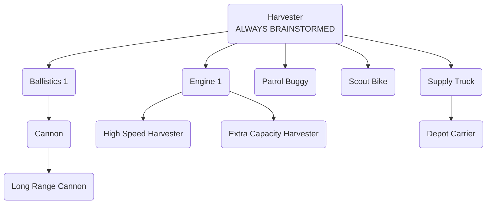

# Kisarra Rules And Documentation

## The Goal

The goal of the game is to collect as much Betirium as possible. The player who
has collected the highest total amount of Betirium by the end of the game wins.

**Total Collected Betirium Includes:**
- **Shipped Betirium**
- **Betirium stored at the base**
- **Betirium currently carried by the player's units**

## Map Configuration

The length of a cell side is 20km.

### Terrain Types

The map features two terrain types: sand fields and mountains.

Units cannot traverse mountain cells; they must navigate around them.

### Betirium Density

There is a number of Betirium areas on the map; this number is the same as the
number of players.

Betirium density within an area decreases exponentially from the area center
(the "source") outwards.

## Supplies

Each turn, the player receives 20 units of supplies for free, and a certain
amount of supplies for the Betirium sent on the previous turn. For every kg of
Betirium sent, the player will receive 5 units of supplies.

Each unit has a "tank" for supplies of a certain capacity. Each unit consumes
1 unit of supplies at the end of each hour.

Supply Trucks can "support" zones. A truck will pick up supplies from the base
and travel to the zone to refill units located there.

When a unit runs out of supplies, its sight range gets decreased to 5.1 km and
the unit becomes inactive until refilled.

After refilling, the unit resumes executing its previous order.

### Depots

In addition to the base, players can construct Depots to manage supplies more
efficiently. Depots are created by deploying Depot Carriers.

Depots act as additional supply sources: units can refuel supplies at Depots
just like at the base.

### Refilling At Supply Sources

While refilling at a supply source, if a unit cannot refill to a full tank, it
will not refill at all (waiting for supplies to appear at the base).

Harvesters refill "automatically" when unloading Betirium at the base.

Supply Trucks with active orders will refill as much as they can.

## Unit Damage

Damage affects the unit's movement speed, leaving other functions unchanged.

Health >75%: no change.

Health between 75% and 25%: speed decreases linearly from 100% to 50%.

Health <25%: speed reduced to 50%.

## Unit Types

### Cannon

When guarding, the Cannon selects targets based on estimated time to eliminate,
factoring in remaining health of the potential target and prioritizing military
targets first. It attacks enemies within its firing range, even if they are
visible to other units, not the Cannon itself.

During attacks, the Cannon aims before firing. Target movement during aiming
reduces shot accuracy; stationary targets maintain full accuracy, while moving
targets result in 50% accuracy.

The Cannon can only attack enemies that are at least 5 kms away from it.

### Depot Carrier

After creation, the Depot Carrier unit is in Park mode: it does not consume
supplies and has a sight range of 5.1 km.

The Depot Carrier has the following commands:

- **Deploy:**
  - The unit moves to the specified point, and upon arrival, transforms into a
  Depot, which has capacity only for supplies.
- **Move & Park:**
  - Moves to the specified location and switches to Park mode upon arrival.

Depot Carrier and Depot have different health point amounts and different
supply capacities. Upon deployment, the Depot receives the same percentage of
health as the Depot Carrier had. It also retains the same amount of supplies.

### Harvester

When harvesting, a Harvester will extract 5% of the Betirium content of the
cell over the course of 1 hour.

When selecting a cell to harvest at, the Harvester considers the time it takes
to fill its tank at that location, along with the time needed to return to the
base while staying within the harvesting area.

When a Harvester arrives to the base for unloading or to refill supplies, it
will first unload Betirium and then attempt to refill itself with supplies
(even if it still has some in the tank).

Harvesters have an option called **"Refill on Low Supplies"**. When enabled,
the Harvester will automatically return to the nearest supply source (base or
Depot) to refill supplies when they drop close to zero.

### Patrol Buggy

When assigned to patrol, the Patrol Buggy checks for visible enemies within the
zone.

If no enemies are present, it moves randomly within the zone.

If enemies are detected, the Patrol Buggy prioritizes attacking military units
first, based on the estimated time to eliminate, factoring in travel time and
the enemy's remaining health. If no military units are present, it will still
attack other units. It engages when within a 5km combat radius.

### Scout Bike

Scout Bikes strive not to be seen by other units. They use public information
about other units' sight ranges for that, not exact values of actual enemies'
unit models.

They do not avoid areas seen by other players' bases.

### Supply Truck

Supply Trucks can perform the following commands:

- **Support:**
  - Refill all units within a designated zone.
- **Move:**
  - Direct the Supply Truck to a specific location without engaging in
  refueling activities.
- **Shuttle:**
  - Set up a continuous route between two points (e.g., base and Depot) to
  transport supplies automatically.

Supply Trucks support zones by refilling all units within the zone. If a Supply
Truck is stuck without supplies within a supported zone, other Supply Trucks
will refill it up to the amount required for the recipient Supply Truck to
return to the nearest supply source and refill itself.

To refill a unit, a Supply Truck has to be within 10km of the receiving unit.

## Engineering

Within a turn, Engineering can brainstorm, build a unit or undertake a
research/design ("R&D") project.

Brainstorming may lead to "discovering" a project, so that the player can
undertake it.

A research project unlocks other R&D projects to be discovered by the player.

### Design Projects

Designing a new unit introduces a new model for production, with some
parameters predefined (e.g., Betirium tank capacity) and others subject to
slight variability (e.g., speed, health points).

Note that these variable parameters are randomly chosen for the model and will
remain consistent across all units of the same model; they won't differ among
produced units.

The player receives a prototype unit immediately after design, with randomly
chosen parameters that are generally inferior to those of regular units.
Regular units, with superior parameters, become available for production from
the next turn onwards.

When designing a new model, parameters for 'regular' units are established
first. Then, for the prototype, each parameter's value is randomly adjusted to
be between 70% and 100% of the value for the regular model.

#### Example

Consider a newly designed harvester with a variable speed ranging from 25
to 35.

If 33 is selected as the speed for the regular model (within the range of 25
to 35), and the random adjustment factor is 75%, the resulting speed for the
prototype would be 24 (rounded down).

Regularly produced harvesters will maintain the chosen speed of 33.

### Brainstorming

Brainstorming has a certain chance of sucess, which is known beforehand.

If the player has completed any R&D project since the last successful
brainstorming, the chance of discovering a new project during the brainstorm is
75%, otherwise it is 30%.

Within the first 5 turns of the game those chances are 100% and 42%
respectively.

### Research tree

