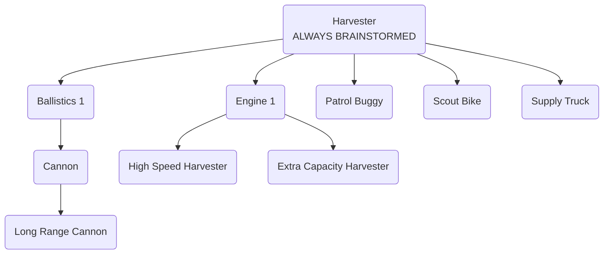

# Kisarra Rules And Documentation

## The Goal

The goal of the game is to ship Betirium. The player who has shipped the most
Betirium by the end of the game wins.

## Map Configuration

The size of the map depends on the number of players:
 * 2 players: 21x21
 * 3 players: 25x25
 * 4 players: 29x29
 * 5 players: 33x33
 * 6 players: 36x36

The length of a cell side is 20km.

There is a Betirium source near each player's base, in the distance between 150
to 187.5kms.

### Betirium Density

There is a number of Betirium areas on the map; this number is the same as the
number of players.

Betirium density within an area decreases exponentially from the area center
(the "source") outwards.

The density of Betirium at the center of an area depends on how far it is from
the center of the map. The expected density decreases linearly from 60 at the
center of the map to 40 at the edge.

The actual density of a Betirium source varies randomly from 0.9 to 1.1 of the
expected density. For example, the source at the very center of the map will
have the actual density between 54 (= 60 * 0.9) and 66 (= 60 * 1.1).

## Supplies

Each turn, the player receives 2 units of supplies for free, and a certain
amount of supplies for the Betirium sent on the previous turn. For every 2 kg
of beririum sent, the player will receive 1 unit of supplies.

Each unit has a "tank" for supplies of a certain capacity. Each unit consumes
1 unit of supplies at the end of each turn.

Supply Trucks can "support" zones. A truck will pick up supplies from the base
and travel to the zone to refill units located there.

When a unit runs out of supplies, its behavior depends on whether it is in a
supported zone.

If a unit without supplies is inside a supported zone, it will remain there and
be inactive until refilled.

If a unit without supplies is outside the zone, it will travel directly to the
base or to the nearest supported zone to refill.

After refilling (at the base or with the help of a truck), the unit resumes
executing its previous order.

While refilling at the base, if a unit cannot refill to a full tank, it will
not refill at all (waiting for supplies to appear at the base). Harvesters
refill "automatically" when unloading Betirium.

## Unit Damage

Damage affects the unit's movement speed, leaving other functions unchanged.

Health >75%: no change.

Health between 75% and 25%: speed decreases linearly from 100% to 50%.

Health <25%: speed reduced to 50%.

## Unit Types

### Cannon

When guarding, the Cannon selects targets based on estimated time to eliminate,
factoring in remaining health of the potential target. It attacks enemies
within its firing range, even if they are visible to other units, not the
Cannon itself.

During attacks, the Cannon aims before firing. Target movement during aiming
reduces shot accuracy; stationary targets maintain full accuracy, while moving
targets result in 50% accuracy.

The Cannon can only attack enemies that are at least 5 kilometers away from it.

### Harvester

When harvesting, a Harvester will extract 5% of the Betirium content of the
cell over the course of 1 hour.

When selecting a cell to harvest at, the Harvester considers the time it takes
to fill its tank at that location, along with the time needed to return to the
base while staying within the harvesting area.

When a Harvester arrives to the base for unloading or to refill supplies, it
will first unload Betirium and then attempt to refill itself with supplies
(even if it still has some in the tank).

### Patrol Buggy

When assigned to patrol, the Patrol Buggy checks for visible enemies within the
zone.

If no enemies are present, it moves randomly within the zone.

If enemies are detected, it prioritizes targets based on estimated time to
eliminate, factoring in travel time and the enemy's remaining health. It
engages when within a 5km combat radius.

### Scout Bike

Scout Bikes strive not to be seen by other units. They use public information
about other units' sight ranges for that, not exact values of actual enemies'
unit models.

They do not avoid areas seen by other players' bases.

When out of supplies, a Scout Bike will drive directly to the nearest refill
point, ignoring any enemy units.

### Supply Truck

Supply Trucks support zones by refilling all units within the zone. Supply
Trucks do not refill other Supply Trucks.

To refill a unit, a Supply Truck has to be within 10km of the receiving unit.

## Engineering

Within a turn, Engineering can brainstorm, build a unit or undertake a
research/design ("R&D") project.

Brainstorming may lead to "discovering" a project, so that the player can
undertake it.

A research project unlocks other R&D projects to be discovered by the player.

### Design Projects

Designing a new unit introduces a new model for production, with some
parameters predefined (e.g., Betirium tank capacity) and others subject to
slight variability (e.g., speed, health points).

Note that these variable parameters are randomly chosen for the model and will
remain consistent across all units of the same model; they won't differ among
produced units.

The player receives a prototype unit immediately after design, with randomly
chosen parameters that are generally inferior to those of regular units.
Regular units, with superior parameters, become available for production from
the next turn onwards.

When designing a new model, parameters for 'regular' units are established
first. Then, for the prototype, each parameter's value is randomly adjusted to
be between 70% and 100% of the value for the regular model.

#### Example

Consider a newly designed harvester with a variable speed ranging from 25
to 35.

If 33 is selected as the speed for the regular model (within the range of 25
to 35), and the random adjustment factor is 75%, the resulting speed for the
prototype would be 24 (rounded down).

Regularly produced harvesters will maintain the chosen speed of 33.

### Brainstorming

Brainstorming has a certain chance of sucess, which is known beforehand.

If the player has completed any R&D project since the last successful
brainstorming, the chance of discovering a new project during the brainstorm is
75%, otherwise it is 30%.

Within the first 5 turns of the game those chances are 100% and 42%
respectively.

### Research tree

