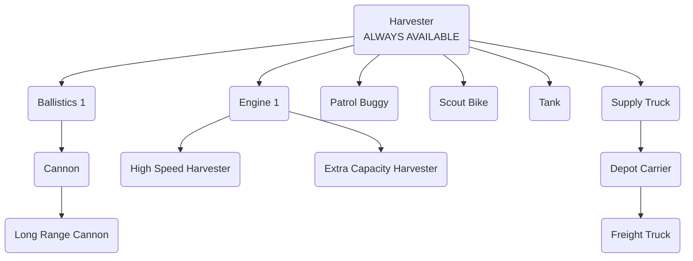

# Kisarra Rules And Documentation

## Turn Structure and Unit Autonomy

Kisarra uses a **turn-based system with autonomous unit execution**:

### How Turns Work

- **Players issue orders once per turn** at the beginning of each 10-hour turn
- **Units execute orders autonomously** throughout the entire turn
- **Units continuously make decisions** about what specific actions to take based on:
  - Their assigned orders from the player
  - Current battlefield conditions
  - Available resources and opportunities
  - Enemy positions and threats

### Strategic vs Tactical Decisions

**Player Orders (Strategic)**:
- Given once at turn start and cannot be changed during execution
- High-level directives such as "Support this zone" or "Patrol this area"
- Focus on overall objectives and resource allocation

**Unit Decisions (Tactical)**:
- Made continuously throughout the turn by each unit
- Specific actions to fulfill orders (which route to take, which target to engage)
- Adaptive responses to changing battlefield situations

### Examples of Unit Autonomy

- **Supply Truck** ordered to "Support Zone" will decide which units to refill, what routes to take, and when to resupply
- **Patrol Buggy** ordered to "Patrol Area" will choose patrol paths, select targets, and adapt to enemy movements
- **Harvester** given extraction orders will pick harvest locations, respond to resource depletion, and decide when to return to base

## Victory Conditions

Kisarra uses a dual-factor scoring system where players must excel in both resource collection and combat:

**Your Score = MIN(Total Betirium Collected, Combat Frags)**

The player with the highest score wins.

**Combat Frags:**
- Points earned by damaging enemy units
- Calculated as: (Unit Production Cost × Health Damage %) × 0.5
- Examples:
  - Destroying a unit that cost 100 Betirium to produce (100% damage): 100 × 1.0 × 0.5 = 50 frags
  - Damaging a unit that cost 100 Betirium to produce by 30%: 100 × 0.3 × 0.5 = 15 frags

This scoring system requires players to balance economic development with military engagement - a purely economic or purely military strategy will be limited by whichever score is lower.

### Game Duration

Games last a fixed number of turns determined by the game configuration, typically ranging from 35 to 75 turns depending on the specific game setup.

## Map Configuration

The length of a cell side is 20km.

### Terrain Types

The map features two terrain types: sand fields and mountains.

Units cannot traverse mountain cells; they must navigate around them.

### Betirium Density

There is a number of Betirium areas on the map.

Betirium density within an area decreases exponentially from the area center
outwards.

## Supplies

Supplies are created automatically when units refill at supply sources by converting Betirium at a rate of **1 kg Betirium = 10 supplies**.

Each unit has a supply tank with a specific capacity. Active units consume 1 unit of supplies per hour, while idle units consume no supplies (except Scout Bikes, which consume supplies even when idle).

When a unit runs out of supplies, its sight range decreases to 5.1 km and the unit becomes inactive until refilled.

After refilling, the unit resumes executing its previous order.

### Depots

In addition to the base, players can construct Depots to manage supplies more
efficiently. Depots are created by deploying Depot Carriers.

Depots act as additional supply sources: units can refuel supplies at Depots
just like at the base.

### Refilling At Supply Sources

**Automatic Conversion Process:**
When a unit refills at the base, the required supplies are automatically created by converting your stored Betirium. For example, if a unit needs 100 supplies to refill, 10 kg of Betirium is automatically converted and deducted from your total.

**Refilling Rules:**
- Most units only refill if they can reach full capacity (all-or-nothing rule)
- Exception: Supply Trucks with active orders refill as much as possible
- Units must be within 10 km of a supply source to refill
- Harvesters automatically refill when unloading Betirium at the base

## Unit Damage

Damage affects the unit's movement speed, leaving other functions unchanged.

Health >75%: no change.

Health between 75% and 25%: speed decreases linearly from 100% to 50%.

Health <25%: speed reduced to 50%.

## Combat System

### Target Prioritization

When engaging enemies, military units are prioritized over economic units.

### Combat Resolution

Shots deal damage instantly when fired (no projectile travel time).

## Zone System

Zones are player-defined areas on the map used to organize and direct unit 
operations. Zones can overlap.

## Movement Rules

Mountains are impassable. Units cannot enter cells containing enemy bases. Units 
can enter cells containing their own base

## Unit Types

### Cannon

When guarding, the Cannon selects targets based on estimated time to eliminate,
factoring in remaining health of the potential target and prioritizing military
targets first. It attacks enemies within its firing range, even if they are
visible to other units, not the Cannon itself.

During attacks, the Cannon aims before firing. Target movement during aiming
reduces shot accuracy; stationary targets maintain full accuracy, while moving
targets suffer reduced accuracy.

The Cannon cannot engage enemies that are too close to it.

### Depot Carrier

After creation, the Depot Carrier unit is in Park mode: it does not consume
supplies and has reduced sight range.

The Depot Carrier has the following commands:

- **Deploy:**
  - The unit moves to the specified point, and upon arrival, transforms into a
  Depot, which has capacity only for supplies.
- **Move & Park:**
  - Moves to the specified location and switches to Park mode upon arrival.

Depot Carrier and Depot have different health point amounts and different
supply capacities. Upon deployment, the Depot receives the same percentage of
health as the Depot Carrier had. It also retains the same amount of supplies.

### Harvester

When harvesting, a Harvester will gradually extract Betirium from the cell
over time.

When selecting a cell to harvest at, the Harvester considers the time it takes
to fill its tank at that location, along with the time needed to return to the
base while staying within the harvesting area.

When a Harvester arrives to the base for unloading or to refill supplies, it
will first unload Betirium and then attempt to refill itself with supplies
(even if it still has some in the tank).

Harvesters have an option called **"Refill on Low Supplies"**. When enabled,
the Harvester will automatically return to the nearest supply source (base or
Depot) to refill supplies when they drop close to zero.

### Patrol Buggy

When assigned to patrol, the Patrol Buggy checks for visible enemies within the
zone.

If no enemies are present, it moves randomly within the zone.

If enemies are detected, the Patrol Buggy prioritizes attacking military units
first, based on the estimated time to eliminate, factoring in travel time and
the enemy's remaining health. If no military units are present, it will still
attack other units. It engages when within combat range.

### Scout Bike

Scout Bikes strive not to be seen by other units. They use public information
about other units' sight ranges for that, not exact values of actual enemies'
unit models.

They do not avoid areas seen by other players' bases.

### Supply Truck

Supply Trucks can perform the following commands:

- **Support:**
  - Refill all units within a designated zone.
- **Move:**
  - Direct the Supply Truck to a specific location without engaging in
  refueling activities.
- **Shuttle:**
  - Set up a continuous route between two points (e.g., base and Depot) to
  transport supplies automatically.

Supply Trucks support zones by refilling all units within the zone. A truck
will pick up supplies from the nearest supply source and travel to the zone to
refill units located there.

If a Supply Truck is stuck without supplies within a supported zone, other
Supply Trucks will refill it up to the amount required for the recipient Supply
Truck to return to the nearest supply source and refill itself.

To refill a unit, a Supply Truck has to be within close range of the receiving unit.

### Tank

Tanks are heavy combat units designed for defensive positioning and area control with rotating turrets.

**Overwatch Operations:**
When given overwatch orders, a Tank positions itself at a designated watch-point and monitors a specified zone for enemies. It uses allied vision to detect threats within the watch-zone only, ignoring enemies outside the designated area.

**Combat Behavior:**
Upon detecting an enemy in its watch-zone, the Tank approaches until within firing range, then stops and rotates both its body and turret to track the target. It uses an aiming system that tracks target movement patterns, achieving higher accuracy against stationary targets compared to moving ones.

**Key Characteristics:**
- Must stop moving to fire (cannot shoot while moving)
- Requires line-of-sight (mountains block shots)
- Cannot engage targets closer than minimum firing range
- Most durable unit with highest health pool for sustained frontline combat
- Zone-constrained operations focus firepower on specific battlefield areas

### Freight Truck

Freight Trucks provide high-capacity supply transport for bulk logistics operations.

**Shuttle Operations:**
Freight Trucks execute continuous round-trip transport between two specified points using a four-phase cycle: Loading → Delivering → Unloading → Returning. This cycle repeats automatically until cancelled.

**Smart Supply Management:**
The Freight Truck intelligently reserves enough supplies for its return journey while delivering the remainder to the destination, ensuring it can always complete its round-trip cycle.

**Key Characteristics:**
- Highest supply capacity among all logistics units
- Operates as a "supply conveyor belt" with simple, reliable point-to-point transport
- Cannot perform flexible zone operations like Supply Trucks
- Complements Supply Trucks by handling fixed routes while Supply Trucks handle dynamic zone support

## Engineering

Within a turn, Engineering can brainstorm, build a unit or undertake a
research/design ("R&D") project.

Brainstorming may lead to "discovering" a project, so that the player can
undertake it.

A research project unlocks other R&D projects to be discovered by the player.

### Design Projects

Designing a new unit introduces a new model for production, with some
parameters predefined (e.g., Betirium tank capacity) and others subject to
slight variability (e.g., speed, health points).

Note that these variable parameters are randomly chosen for the model and will
remain consistent across all units of the same model; they won't differ among
produced units.

The player receives a prototype unit immediately after design, with randomly
chosen parameters that are generally inferior to those of regular units.
Regular units, with superior parameters, become available for production from
the next turn onwards.

When designing a new model, parameters for 'regular' units are established
first. Then, for the prototype, each parameter's value is randomly adjusted to
be between 70% and 100% of the value for the regular model.

#### Example

Consider a newly designed harvester with a variable speed ranging from 25
to 35.

If 33 is selected as the speed for the regular model (within the range of 25
to 35), and the random adjustment factor is 75%, the resulting speed for the
prototype would be 24 (rounded down).

Regularly produced harvesters will maintain the chosen speed of 33.

### Brainstorming

Brainstorming has a certain chance of sucess, which is known beforehand.

If the player has completed any R&D project since the last successful
brainstorming, the chance of discovering a new project during the brainstorm is
75%, otherwise it is 30%.

Within the first 5 turns of the game those chances are 100% and 42%
respectively.

### Research tree

```mermaid
graph TD;
    harvester(Harvester\nALWAYS AVAILABLE);
    harvester-->ballistics-1(Ballistics 1);
    ballistics-1-->cannon(Cannon);
    cannon-->long-range-cannon(Long Range Cannon);
    harvester-->engine-1(Engine 1);
    engine-1-->high-speed-harvester(High Speed Harvester);
    engine-1-->extra-capacity-harvester(Extra Capacity Harvester);
    harvester-->patrol-buggy(Patrol Buggy);
    harvester-->scout-bike(Scout Bike);
    harvester-->tank(Tank);
    harvester-->supply-truck(Supply Truck);
    supply-truck-->depot-carrier(Depot Carrier);
    depot-carrier-->freight-truck(Freight Truck);
```
