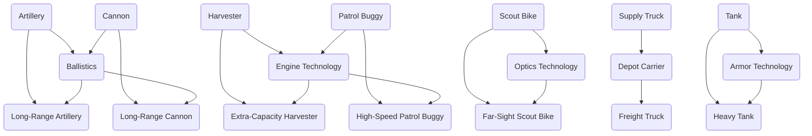

# Kisarra Rules And Documentation

These rules describe Kisarra v11.

Kisarra is a turn-based strategy game. You give orders to your units once per
turn. During the turn, the units carry out the orders without your help. To
win, you must collect Betirium and you must damage enemy units.

## Contents

- [The Turn](#the-turn)
- [Winning](#winning)
- [The Map](#the-map)
- [Sight And Fog Of War](#sight-and-fog-of-war)
- [Betirium And Supplies](#betirium-and-supplies)
- [Damage And Repair](#damage-and-repair)
- [Combat](#combat)
- [Orders Every Unit Takes](#orders-every-unit-takes)
- [Units](#units)
- [Engineering](#engineering)

Some values in this document are game settings. Each game can set them to
different values. This document names the setting each time, and gives the
value that games usually use.

## The Turn

A turn lasts 10 hours of game time. The game divides a turn into 200 ticks.
One tick is 3 minutes of game time.

You give orders before a turn starts. You cannot change them while the turn
runs.

### What You Decide And What Units Decide

You decide which job each unit does. For example, you tell a Patrol Buggy
which zone to patrol and which kind of enemy to attack there.

The unit decides how to do the job. On every tick, it looks at what your side
can see, and chooses its route, its target, and when to refill.

Because you cannot correct a unit during the turn, give orders that still work
if the situation changes.

### Examples

A **Supply Truck** with a Feed order drives to the point you chose and parks.
It gives supplies to the units near it. When its own supplies run low, it
drives to its supply source, refills, and drives back to the same point. You
do not need to give it new orders for this.

A **Patrol Buggy** with a Patrol order drives to its zone by itself. On the
way, it can stop to attack an enemy, if it can still reach the zone in time.
In the zone, it goes to the cells that your side has not seen for the longest
time.

A **Harvester** chooses which cell to dig. When a cell becomes empty, the
Harvester moves to another one. It drives around mountains, and it decides
when to drive back to the base.

### Start Of A Turn

At the start of each turn:

1. You get 5 Betirium at your base.
2. Your engineering work moves forward by one turn.

At the start of the game, you have 2 Harvesters at your base and no Betirium.
You get your first 5 Betirium at the start of turn 1.

### End Of A Turn

At the end of each turn, after the last tick, new units arrive at random
points in your base cell:

1. The units you built this turn.
2. The prototype of a design that you completed this turn.

No tick of the turn contains these units. Nothing can shoot them, and they do
not block other units. You give them orders on the next turn.

A player who can see your base also sees the new units arrive.

## Winning

Your score is the lower of two numbers: the Betirium you collected, and your
frags.

**Score = MIN(Betirium collected, Frags)**

The player with the highest score at the end of the game wins.

**Example.** You collect 900 Betirium and earn 200 frags. Your score is 200.
To raise it, you must earn more frags. More Betirium does not help.

### Betirium Collected

This number includes:

- The Betirium you spent on supplies when your units refilled at a base
- The Betirium stored at your base
- The Betirium that your units carry

### Frags

You earn frags when you damage an enemy unit. The unit does not have to die.

**Frags = cost of the unit × part of its health you removed × frag factor**

The cost of the unit is the Betirium its owner paid to build it.

**Example.** An enemy unit cost 100 Betirium. You remove 20% of its health.
The frag factor is 1.5. You earn 100 × 0.2 × 1.5 = 30 frags.

### The Frag Factor

The frag factor changes during the game. Damage done early in the game earns
more frags than the same damage done late.

- During the first 25% of the turns, the frag factor stays at its maximum.
- After that, it decreases by the same amount each turn. On the last turn it
  reaches its minimum.

The `frag-factor` setting gives the maximum and the minimum. Games usually use
a maximum of 1.5 and a minimum of 0.7.

**Example.** A game has 100 turns and uses 1.5 and 0.7. You remove 20% of the
health of a unit that cost 100 Betirium.

| Turn | Frag factor | Frags |
|---|---|---|
| 10 | 1.5 | 30 |
| 50 | 1.2 | 24 |
| 100 | 0.7 | 14 |

### Length Of A Game

The game organizer sets the number of turns when they create the game. The
game creation page suggests a number from the number of players:

`turns = round((40 + 3 × (players − 2)) ÷ 5) × 5`

This gives 40 turns for 2 players, 45 turns for 3 or 4 players, and 50 turns
for 5 or 6 players. The organizer can type a different number.

### Surrender

You can surrender instead of playing to the end.

After you surrender:

- You cannot give orders. The game also cancels the orders you gave for the
  current turn.
- The game does not wait for you. A turn ends when all players who have not
  surrendered send their orders.
- Your units and your base stay on the map. Your units continue to do the last
  orders they received. They harvest, move and shoot. The enemy can still
  destroy them.
- You can still open the game and watch every turn. At the end, you see the
  final score and the leaderboard.
- The game calculates your score in the same way as for every other player.
- You cannot cancel the surrender. Only the game organizer can.

When only one player has not surrendered, the game ends. The game plays the
current turn as the last turn, even if the turn limit is higher. That turn
uses the frag factor for its own turn number.

## The Map

The map is a square grid of cells. Each cell is 20 km by 20 km.

The terrain type applies to a full cell. A unit can stand at any point in a
cell, not only at the center.

- **X** increases from west to east (left to right).
- **Y** increases from north to south (top to bottom).
- A positive angle turns clockwise.

### Terrain

**Sand.** All units can drive on sand. A sand cell can contain Betirium.

**Mountains.** No unit can drive into a mountain cell. Units drive around
mountains. Mountains also stop Tank shots.

**Bases.** Each player starts at a base. A base is a supply source. Harvesters
unload Betirium at the base.

### Betirium In The Ground

Each sand cell contains its own amount of Betirium. The game does not group
cells into fields. When this document says "field", it means a group of
neighboring cells that contain a lot of Betirium.

Betirium grows back in each sand cell. Each cell has a regeneration value. In
30 turns, the cell gains that amount of Betirium. The cell gains a small part
of it on every tick.

**Example.** A cell has a regeneration value of 30. It gains 30 kg in 30
turns, which is 1 kg per turn. If you dig 10 kg out of it, it is back to its
original amount after 10 turns. A cell with a regeneration value of 0 never
grows back.

### Rich Betirium Fields

Rich Betirium Fields are areas with a lot of Betirium that grows back quickly.
They are not on the map at the start. They appear during the game.

**Where they appear.** The game calculates a pressure value for the ground
around each base. The pressure increases every hour in a ring around the base.
The distance from the base to the ring depends on the distance to the nearest
other base. When the pressure at a point reaches a limit, a Rich Field appears
near that point.

**Between two players.** Where the rings of two bases overlap, the pressure
from both bases adds together. There, the pressure increases about twice as
fast. So Rich Fields often appear between players.

**When they appear.** The first Rich Field appears at about turn 5. In the
next few turns, the map gets about one Rich Field for each two bases. After
that, more Rich Fields appear more slowly. Most are on the map by the middle
of the game. Sometimes one appears later in a far part of the map.

**Distance between them.** A new Rich Field does not appear near another Rich
Field. It can appear near a normal field.

**Mountains.** Pressure does not spread across mountains or bases. A Rich Field
can only appear on ground that units can drive to.

**Duration.** A Rich Field stays until the end of the game.

**Finding them.** The game does not tell you when a Rich Field appears. You
find it when one of your units sees it.

### Movement Rules

- No unit can enter a mountain cell.
- A unit cannot enter the base cell of a player that its owner is at war with.
- A unit can enter the base cell of a player that its owner is at peace with.
- A unit can enter its own base cell.

### Zones

A zone is an area of the map that you draw and name in the game client. You
draw zones between turns. Zones can overlap. You can have as many zones as you
want.

A zone has no effect alone. You use a zone in an order. For example, a Patrol
order tells a Patrol Buggy which zone to patrol.

## Sight And Fog Of War

### Sight Ranges

The `default-sight-range` setting gives the sight range of most units. Games
usually use 37.5 km.

| Unit | Sight range |
|---|---|
| Most units | The default sight range |
| Scout Bike, active | About twice the default sight range |
| Scout Bike, on station | The default sight range |
| Supply Truck, Freight Truck, Depot Carrier | 7.5 km |
| Deployed depot | The default sight range |
| Base | The default sight range |
| Any unit with no supplies | 5.1 km |

The 5.1 km value is always the same. The game setting does not change it.

### What You See

**Your units share what they see.** When one of your units sees something, all
your units know about it.

**Terrain.** When your units see the terrain of a cell, it stays visible on
your map until the end of the game.

**Betirium.** Your map shows the amount of Betirium that your units saw last
time in each cell. The real amount can be lower, because someone dug it after
you looked. Your Harvesters use the amount on your map. When a Harvester
arrives and finds less, it chooses a new cell.

**Enemy units.** You see an enemy unit only while it is in the sight range of
one of your units. When it leaves that range, it disappears from your map.

**When you last looked.** The game records, for each cell, the last time one
of your units saw it. Patrol Buggies use this to decide where to search.

### Line Of Sight When Shooting

Your units see targets together. But a unit can shoot a target only if its
weapon allows it:

- A **Tank** needs a clear line to the target. It cannot shoot through a
  mountain.
- A **Cannon** and an **Artillery** can shoot at any target your side can see.
  Mountains do not stop them.

## Betirium And Supplies

Betirium is the only resource. You use it to build units and to make
supplies. Units use supplies as fuel.

### Harvesting

A Harvester digs 5% of the Betirium in its cell every hour. So a cell with more
Betirium gives more per hour. As the cell empties, it gives less per hour.

**Example.** A Harvester digs a cell that contains 100 kg. In the first hour,
it gets 5 kg, and 95 kg stay in the cell. In the second hour, it gets 5% of
95 kg, which is 4.75 kg. A cell that contains 20 kg gives only 1 kg in the
first hour.

At the base, a Harvester unloads 50 kg per hour.

### Making Supplies

You do not keep a store of supplies. When a unit refills at your base, the
game uses your Betirium to make the supplies at that moment.

The `supplies-per-betirium` setting says how many supplies you get for 1 kg of
Betirium. Games usually use 15.

**Example.** A unit needs 60 supplies. At 15 supplies per kg, this uses 4 kg
of your Betirium. These 4 kg still count in your Betirium collected.

### Using Supplies

- A unit that moves or works uses 1 supply per hour, which is 0.05 per tick.
- A unit that does nothing uses no supplies.
- A **Scout Bike** uses supplies even when it stands still. On station, it
  uses none.
- A **Depot Carrier** that is parked uses no supplies.

### Supply Sources

A unit can refill at a **base** or at a **deployed depot**. It must be within
10 km of it.

A base has no limit on supplies. A depot has a limited amount.

A Depot Carrier that has not deployed is not a supply source.

### Refilling

A unit refills only if the source can fill its tank completely. If the source
cannot, the unit does not refill.

There are two exceptions:

- A **Supply Truck** that has an order takes as much as the source has.
- A **top-up** (see below) takes as much as the source has.

**Top-up.** Some units refill before their tank is empty. The unit sections
below say which units do this. Such a unit refills when:

- its tank is less than 90% full, and
- it is within 10 km of a source, and
- the source has at least half of the supplies the unit needs to be full.

**Example.** A Tank has a tank of 60 supplies. It drives past a depot.

| Tank has | Tank needs | Depot must have | What happens |
|---|---|---|---|
| 55 | 5 | — | Tank is more than 90% full. It does not stop. |
| 40 | 20 | 10 or more | Depot has 10. Tank refills. |
| 40 | 20 | 10 or more | Depot has 8. Tank does not stop. |

A Harvester refills at the base after it unloads Betirium, even if it still
has some supplies.

### Supply Trucks Feeding Units

A Supply Truck with a Feed order parks at a point you choose. It gives
supplies to your units near it. The units do not need to drive to the truck,
and the truck does not drive to them.

**Distance.** The truck feeds units within 50 km of where it stands.

**Speed.** The truck gives 1 supply at a time, and at most 1 per tick. A
moving unit uses 1 supply per hour. So a truck that gives 3 supplies per hour
can keep 3 moving units full. A damaged truck gives supplies more slowly. The
decrease follows the same rule as the speed decrease (see
[Damage And Speed](#damage-and-speed)).

**Which units get supplies.** A unit gets supplies from the truck only if all
of these are true:

- The unit belongs to the same player as the truck.
- The unit's Receive Supply setting is on.
- The unit's tank has space for at least 1 supply.
- The unit does not have enough supplies to drive to a base or depot and
  arrive with 5 supplies left. (A unit that can drive there refills there for
  free.)
- The unit is not a Depot Carrier. A Supply Truck or a Freight Truck gets
  supplies only if it cannot reach a base or depot on its own.

**Order of units.** First, the truck feeds any Supply Truck that cannot reach a
base or depot. Then it feeds the unit that has the fewest supplies. This means
the lowest number of supplies, not the lowest percentage of its tank.

**Receive Supply setting.** Every unit has this setting. It is on unless you
turn it off. You set it together with your orders. It stays the same when the
unit gets new orders. When it is off, the unit gets nothing from any Supply
Truck. It can still refill at a base or depot.

**The truck keeps enough to drive back.** The truck keeps enough supplies to
drive back to its source, plus 5 more. When it has only that amount left, it
drives to the source to refill.

**The truck refills before a long drive.** Before it drives to a new feeding
point, the truck calculates the supplies it needs to drive there and then back
to its source. If it has less than that plus 5, it goes to the source first
and fills its tank.

**The truck does not go to a point it cannot return from.** If a full tank is
not enough to drive from the source to the point and back with 5 supplies
left, the truck does not go. It also does not go if no route reaches the
point. In both cases the truck stays where it is and gives no supplies. It
keeps the order. On every tick it checks the order again. If the truck is
repaired or a source gets closer, it starts the order without a new command.

### No Supplies

When a unit has no supplies, it stops. Its sight range becomes 5.1 km. It uses
no more supplies.

The unit cannot drive to a supply source, because driving uses supplies. It
can get supplies in two ways only:

- It stopped within 10 km of a base or a deployed depot. Then it refills
  there.
- A Supply Truck comes within 50 km and gives it supplies.

If neither happens, the unit stays where it is until the end of the game. It
is not destroyed, but it does nothing.

After it gets supplies, the unit continues its last order.

## Damage And Repair

### Damage And Speed

Damage makes a unit slower. It does not change anything else about the unit.

- With more than 75% health, the unit moves at full speed.
- From 75% health down to 0%, the speed decreases evenly from full speed to
  one third of full speed.

**Example.** A unit has a full speed of 20 km/h.

| Health | Speed |
|---|---|
| 100% | 20 km/h |
| 75% | 20 km/h |
| 50% | 15 km/h |
| 25% | 10 km/h |
| 1% | 6 km/h |

### Self-Repair

A damaged unit repairs itself. It pays with the supplies it carries.

**When it repairs.** A unit repairs only when its health is below 80%. It
stops at 80%. To get the last 20%, you must build a new unit.

**Only when not busy.** A unit repairs on each tick when it is not moving,
aiming or shooting. A unit that is standing still, harvesting, taking supplies
or giving supplies does repair. A unit that is standing still under enemy fire
also repairs.

**Speed of repair.** A unit repairs 2% of its maximum health per hour. This is
the same for all units. From 0% health, a unit reaches 80% in 40 hours, which
is 4 turns.

**Cost of repair.** The repair costs one quarter of what the same health cost
to build. The game charges it in supplies. So a unit that cost more to build
uses more supplies to repair.

**Example.** A unit cost 100 Betirium to build. The game uses 15 supplies per
Betirium. In one hour, the unit repairs 2% of its health. Building 2% of the
unit costs 2 Betirium. One quarter of that is 0.5 Betirium, which is 7.5
supplies. So the repair uses 7.5 supplies per hour. A unit that cost 10
Betirium uses 0.75 supplies per hour.

**Supplies for driving.** Repair never uses the lower half of the unit's
supply tank. The unit keeps that half for driving. A unit at a base or depot
refills while it repairs, so it does not reach the lower half.

**Repairs Itself setting.** Every unit has this setting. It is on unless you
turn it off. You set it together with your orders. It stays the same when the
unit gets new orders.

**Depots.** A deployed depot also repairs. It pays from its own supplies. It
always keeps at least half of its supplies for other units.

When a unit is repairing, its panel shows a mark next to its health. All
players who can see the unit see this mark.

## Combat

### Shooting

A Tank and a Patrol Buggy must stop to shoot. They cannot shoot while they
move.

A Cannon and an Artillery must reach their firing position before they
shoot. They cannot shoot while they move.

Each weapon has a minimum range and a maximum range. A weapon cannot hit a
target that is closer than its minimum range.

### Aiming And Accuracy

A Tank and a Cannon aim at the target before each shot. If the target does
not move while they aim, they hit more often.

- If the target moves the whole time: about 37% of shots hit.
- If the target does not move at all: 75% of shots hit.

A Cannon aims for 15 minutes, then reloads for 15 minutes. It shoots twice per
hour.

A Tank aims for 5 ticks (15 minutes), then reloads for 15 minutes.

A Patrol Buggy does not aim. When its target is in range, it shoots on about
half of the ticks.

### Choosing A Target

Units attack military units before economic units. When several targets are
equal:

- A Cannon attacks the target with the least health.
- A Patrol Buggy attacks the target it can destroy in the shortest time.

A unit keeps its target until another target is much better. It changes its
target at once when the target is destroyed, when your side can no longer see
the target, or when the target leaves the zone in the order.

### When Damage Happens

A Tank, a Patrol Buggy and a Cannon cause damage at the moment they shoot.

An Artillery fires a shell. The shell flies for some time before it lands.
The shell can miss. It damages every unit near the point where it lands. This
includes your own units.

## Orders Every Unit Takes

### Move

Every unit can take a Move order. You give a route of up to 9 points. The unit
drives to each point in order.

At the last point, most units stop and wait for a new order. A Tank stops and
guards the area (see [Tank](#tank)). A Depot Carrier stops and parks.

### Points The Unit Cannot Reach

During a turn, a point on the route can become impossible to reach. For
example, your units find mountains in the way, or a base closes to you because
a peace ends.

- If this happens to a point in the middle of the route, the unit skips that
  point and drives to the next one.
- If this happens to the last point, the unit drives to the nearest place it
  can reach, and the order ends there.

## Units

### Combat Units

#### Artillery

An Artillery fires shells over a long distance. It can hit targets in a ring
around it. It cannot hit targets closer than the inner edge of the ring or
farther than the outer edge.

**Orders**

- **Guard.** This is the default order. The Artillery drives to the firing
  position you choose. It shoots at enemies that your side can see anywhere in
  its ring. When it sees no enemy, it stays loaded and waits.
- **Suppress.** The Artillery drives to the firing position you choose. It
  shoots all the time into a 30-degree area: 15 degrees to each side of a
  direction you choose. When your side sees an enemy in that area, it shoots
  at the enemy. When not, it shoots at random points in that area that are
  far enough from your own units.
- **Move.** The Artillery drives the route. At the last point, it stops. It
  does not shoot and uses no supplies until you give a new order.

**How it works**

- It needs 2 hours to load before each shot.
- It uses what your whole side sees. It does not need a clear line to the
  target.
- It cannot shoot while it moves.
- You can see a shell in flight when it is within the sight range of one of
  your units.

**Spread.** A shell does not land exactly on the point where the Artillery
aims. The farther the target, the farther from the aim point the shell can
land. Each Artillery design has a spread value for the inner edge of its ring
and one for the outer edge. For targets in between, the spread is between
these two values.

**Example.** An Artillery design has a spread of 15 km at the inner edge of
its ring and 30 km at the outer edge. A shell aimed at a target at the inner
edge lands within about 15 km of it. At the middle of the ring, within about
22.5 km. At the outer edge, within about 30 km. The closer the target, the
more accurate the Artillery.

**Choosing where to aim.** For each possible aim point, the Artillery
calculates the average damage over all the places where the shell can land.
It chooses the point with the highest average. Against a group of enemies,
this is usually near the middle of the group.

**Friendly fire.** A shell damages every unit near where it lands, including
yours. The Guard and Suppress orders have a friendly-fire option:

- **Off** (default). The Artillery shoots only where the expected damage to
  your units is at most 5% of the damage at the center of a shell hit. Because
  far shots spread more, the Artillery keeps a bigger distance from your units
  when it shoots far.
- **On.** When your side sees enemies, the Artillery shoots where the enemy
  damage minus the damage to your units is highest. When your side sees no
  enemies, it still avoids your units.

#### Cannon

A Cannon shoots at long range. It can shoot at any enemy that your side sees
within its range. It does not need to see the target itself. Mountains do not
stop its shots.

- **Guard.** The Cannon stays at its position. It shoots at enemies within its
  range.
- It aims for 15 minutes and reloads for 15 minutes. It shoots twice per hour.
- It cannot hit an enemy closer than its minimum range.
- It attacks military units before economic units. Among those, it attacks the
  unit with the least health.

#### Patrol Buggy

A Patrol Buggy is a fast unit with a short weapon range. It must stop to
shoot.

**Patrol order.** You choose a zone and a type of enemy.

The types of enemy are:

| Type | Includes |
|---|---|
| Any enemy | All enemy units |
| Artillery | Artillery only (not Cannons) |
| Combat units | Artillery, Cannons, Patrol Buggies, Tanks |
| Harvesters | Harvesters |
| Logistics | Depot Carriers, Freight Trucks, Supply Trucks |

Only "Any enemy" includes Scout Bikes. If you choose no type, the Patrol Buggy
attacks any enemy.

What the Patrol Buggy does:

- **Drives to the zone.** It drives to the zone without a Move order.
- **Attacks on the way.** On a long drive to the zone, it can leave its route
  to attack an enemy of the chosen type, anywhere your side can see. It does
  this only if it can still reach the zone by a deadline. The game sets the
  deadline once, at the start of the drive, so many small attacks cannot delay
  the Patrol Buggy without end. On a short drive, it does not stop to attack.
- **Attacks in the zone only.** In the zone, it attacks only enemies that are
  inside the zone.
- **Searches.** When no enemy of the chosen type is in the zone, it drives to
  a zone cell that your side has not seen for a long time. It chooses at random
  among the cells that your side has not seen for the longest time. Cells your
  side has never seen come first. Any of your units counts. So if a Scout Bike
  has just seen a cell, the Patrol Buggy does not go there.
- **Chooses a target.** It does not attack enemies of other types. It attacks
  military units before economic units. Among those, it attacks the unit it
  can destroy in the shortest time. It keeps its target until another target
  is much better.

**Overwatch order.** You choose a watch point and a watch zone.

- The Patrol Buggy drives to the watch point and turns to face the center of
  the zone. It turns at once.
- When your side sees an enemy in the watch zone, the Patrol Buggy attacks
  it. It follows the enemy only inside the zone. When no enemy is left in the
  zone, it goes back to the watch point.
- It does not attack enemies outside the zone. It attacks all types of enemy
  in the zone.
- It uses no supplies while it waits at the watch point. It uses supplies
  only when it moves or shoots.

**Move order.** See [Move](#move).

**Sleep order.** The Patrol Buggy stops its current order.

The Patrol Buggy tops up (see [Refilling](#refilling)).

#### Tank

A Tank has the most health of all units. Its turret can turn up to 90 degrees
to each side of the Tank's body. The body turns slowly.

**No order.** A Tank with no order stays where it is. It shoots at any enemy
that it can hit from there. It turns its body and turret to shoot, but it
does not drive toward the enemy.

**Overwatch order.** You choose a watch point and a watch zone.

- The Tank drives to the watch point.
- When your side sees an enemy in the watch zone, the Tank drives toward the
  enemy until the enemy is in range.
- When no enemy is in the zone, and the Tank is at its watch point, it can
  also shoot at enemies outside the zone. It only shoots at enemies it can hit
  without moving.
- While the Tank drives to its watch point, it shoots only at enemies inside
  the zone.

**How it attacks.** The Tank drives until the target is in range. It stops. It
turns its body and turret toward the target. It aims for 5 ticks and shoots.
It reloads for 15 minutes. When no enemy is left in the zone, it goes back to
the watch point.

**Move order.** The Tank drives the route. At the last point, it stops and
acts as a Tank with no order. Before each part of the route, it turns its body
to face the next point. It does not move until it faces that point. During a
long drive, the turret slowly turns back to face forward.

**Shooting.** Mountains stop Tank shots. A Tank cannot hit targets closer than
its minimum range.

**Top-up.** The Tank tops up (see [Refilling](#refilling)). It stops what it
is doing to top up, except when it is attacking a target. While it tops up,
its panel still shows its order.

**Standby order.** The Tank stops its current order.

### Logistics Units

#### Depot Carrier

A Depot Carrier drives to a place and changes into a depot there.

- **Move.** It drives the route and parks at the last point. It stays a Depot
  Carrier.
- **Deploy.** It drives to the point you choose and changes into a depot.
- **Parked.** A parked Depot Carrier uses no supplies.

A deployed depot is a supply source. Your units can refill there from within
10 km. A Supply Truck can use the depot as its supply source. Then the truck
does not need to drive back to the base to refill.

With a depot, your Harvesters can refill far from the base.

**What changes when it deploys.** The depot has more maximum health and a
bigger supply tank than the Depot Carrier.

- The depot has the same percentage of health as the Depot Carrier had.
- The depot has the same number of supplies as the Depot Carrier had. Only
  the tank is bigger.

**Example.** A Depot Carrier has a maximum health of 40 and a supply tank of
80. The depot has a maximum health of 180 and a supply tank of 330.

| Depot Carrier before | Depot after |
|---|---|
| 40 of 40 health (100%) | 180 of 180 health (100%) |
| 20 of 40 health (50%) | 90 of 180 health (50%) |
| 10 of 40 health (25%) | 45 of 180 health (25%) |
| 60 of 80 supplies | 60 of 330 supplies |

So a damaged Depot Carrier becomes a damaged depot. The depot must then repair
itself, which costs more supplies than for the Depot Carrier.

**You cannot undo a deployment.** The depot stays where it is until the end
of the game.

#### Freight Truck

A Freight Truck carries more supplies than any other unit. It moves supplies
between two points.

- **Shuttle.** You choose two points. The truck loads supplies at the first
  point, drives to the second point, unloads there, and drives back. It
  repeats this until you give the Standby order. It keeps enough supplies to
  drive back and unloads the rest.
- **Move.** The truck drives the route and waits at the last point. It keeps
  all its supplies. It does not load or unload during a Move order.
- If the truck has no supplies during a drive, it waits where it is. When a
  Supply Truck gives it supplies, it continues.

A Freight Truck does not give supplies to units near it. Only a Supply Truck
does that.

If a Freight Truck does not have enough supplies to reach its loading point,
a Supply Truck with a Feed order near it can give it supplies.

#### Supply Truck

A Supply Truck gives supplies to your units in an area that you choose.

- **Feed.** You choose a point and a supply source. The source is a base or a
  deployed depot. The truck drives to the point, parks, and gives supplies to
  your units near it. For the full rules, see
  [Supply Trucks Feeding Units](#supply-trucks-feeding-units).
- **Move.** The truck drives the route and waits at the last point.

With a Feed order, the truck does all this without new orders:

1. It gives supplies to units near the point.
2. When it has only enough supplies to drive back, it drives to the source.
3. It refills.
4. It drives back to the same point and continues.

If its source no longer exists, for example because the enemy destroyed the
depot, the truck uses the nearest source it can reach.

You choose where the truck feeds. The truck chooses which unit gets the next
supply.

If the point is far from the source, the truck spends most of its time
driving. If the point is so far that a full tank is not enough to drive there
and back, the truck does not go (see
[Supply Trucks Feeding Units](#supply-trucks-feeding-units)).

### Economic Units

#### Harvester

A Harvester digs Betirium and brings it to your base.

A Harvester goes back to the base when its Betirium tank is full. It unloads
the Betirium there. It can refill only at a base or a deployed depot. It
cannot refill at a Depot Carrier that has not deployed.

**Auto-Harvest order.** A new Harvester has this order.

- The Harvester looks at every cell on the map that your side has seen and
  that contains Betirium.
- For each cell, it calculates how much Betirium per hour it would get. The
  calculation includes the time to drive to the cell, dig, and drive back to
  the base.
- In the calculation, it never counts more Betirium than its tank can hold.
- It uses the Betirium amount on your map, not the real amount. If the cell
  has less when it arrives, it chooses a new cell.
- It expects less Betirium from a cell that your other Harvesters with this
  order already plan to dig. So your Harvesters spread over different cells.
- When no cell is worth digging, the Harvester drives to the base and waits.
- It calculates again from time to time, and when something changes.

**Refill on low supplies option.** This option is on by default.

- **On.** The Harvester chooses only cells from which it can drive back to a
  base or depot. Before its supplies are too low to reach a base or depot, it
  drives there to refill.
- **Off.** The Harvester chooses the cells with the most Betirium per hour,
  even if they are far from a base or depot. It does not drive back early to
  refill. It digs until it has no supplies, and then it stops where it is.

A Harvester with no supplies cannot drive to a base or depot. It refills only
if it stopped within 10 km of a base or deployed depot. If not, it must wait
for a Supply Truck (see [No Supplies](#no-supplies)). Turn this option off
only if a Supply Truck feeds the area where the Harvester digs.

**Caution level.** The Auto-Harvest order has a caution level. It tells the
Harvester which cells to avoid because enemies can attack there.

The Harvester knows about two kinds of danger:

- **Enemy weapons.** When your side sees an armed enemy unit, the area that
  the enemy can shoot is dangerous. When your side stops seeing the enemy,
  that area stays dangerous for 1 to 4 hours. The time is shorter for fast
  enemy units, because they could already be far away.
- **Shell hits.** When your side sees an Artillery shell land, the area within
  30 km of that point is dangerous for 2 hours.

The caution levels are:

| Level | Which cells the Harvester avoids |
|---|---|
| Fearless | None. The Harvester ignores danger. |
| Normal | Cells that an enemy weapon can reach. Cells where two or more recent shell hits overlap. One shell hit alone does not stop it. |
| Paranoid | All cells with any danger. |

If the order does not give a level, the Harvester uses Normal.

The Harvester does not choose a dangerous cell, even if the cell has much more
Betirium than other cells. If the cell where a Harvester digs becomes
dangerous, the Harvester leaves at once. If all cells are dangerous, the
Harvester delivers what it carries to the base and waits there.

**Enemy weapon range.** Each type of enemy unit has several designs, and some
designs shoot farther than others. At first, the Harvester assumes that every
enemy unit of a type has the shortest range of that type. When your side sees
an enemy unit of that type shoot farther, the Harvester uses that longer
range for all enemy units of that type until the end of the game.

For Artillery, your side must see the shell leave the Artillery and must also
see it land. The distance between the two points is the range.

This works with the shots of any other player's units, not only enemies. It
also works with shots your side sees during peace.

So if your units see enemy units shoot, your Harvesters avoid danger better.

**Harvest order.** You choose a zone. The Harvester looks at the cells in the
zone that your side has seen. For each cell, it uses the Betirium amount on
your map. It calculates the time to drive there, fill its tank, and drive
back. It chooses the cell with the shortest time. It calculates again every
hour and when you change the zone.

### Reconnaissance Units

#### Scout Bike

A Scout Bike is the fastest unit. When active, it sees about twice as far as
most units. It has little health, so it tries to stay where enemies cannot
see it.

- **Move.** It drives to its route points in order. It leaves the route when
  it must escape from enemies.
- **Station.** It drives to a point and waits there. While it waits, its sight
  range is the default sight range and it uses no supplies. When an enemy
  comes close enough to see it (see below), it becomes active. When the enemy
  is gone, it goes back to the point and waits again.

**How it escapes**

- It watches for enemies that could see it. It calculates this with the
  enemy's sight range plus 5 km. It uses the standard sight range of each
  type of unit, not the sight range of the enemy's actual design.
- When an enemy could see it, it looks at 13 positions: where it is now, and
  12 points in a circle around it. It moves to the position that is farthest
  from all enemies. If its current position is the best, it stays.
- It continues to escape for 10 ticks after the enemies are gone. This stops
  it from moving back and forth.
- It stays out of the sight range of deployed enemy depots. That range is the
  default sight range.

The Scout Bike tops up (see [Refilling](#refilling)). When it is not on
station, it uses supplies even while it stands still.

## Engineering

Each turn, engineering does two things at the same time:

1. **Building.** You build units from designs that you have completed.
2. **Research.** You do one of two things: brainstorm to find a new project,
   or work on a project you already found.

### Building

- You can build any number of units of any types in one turn.
- You must have enough Betirium for all the units in the order. If you do not,
  the game builds none of them.
- You pay the Betirium at the start of the turn.
- The units arrive at the end of the turn. See
  [End Of A Turn](#end-of-a-turn).

### Brainstorming

A brainstorm finds one new project. It always succeeds, if there are projects
you have not found yet.

- Each of your first 4 brainstorms takes 1 turn.
- Each brainstorm after that takes 2 turns.

If you stop a brainstorm to work on a project, the brainstorm keeps its
progress. Each player finds projects separately. Two players can find the same
project on different turns.

### Working On A Project

Each turn you work on a project, it moves forward by one turn. If you stop and
work on another project, the first project keeps its progress.

There are 19 projects. These 9 take 1 turn for every player in every game:
Artillery, Cannon, Depot Carrier, Freight Truck, Harvester, Patrol Buggy,
Scout Bike, Supply Truck and Tank.

Of the other 10 projects, 2 take 1 turn and 8 take 2 turns. When the game
starts, it chooses at random which projects take 1 turn for each player. So
the same project can take 1 turn for one player and 2 turns for another.

**Example**

- Turn 5: You start Ballistics. It takes 2 turns for you. It is 1 of 2 done.
- Turn 6: You work on Optics Technology. It takes 1 turn for you. It is done.
- Turn 7: You work on Ballistics again. It is 2 of 2 done.

**If you give no research order**, engineering does the first of these that it
can:

1. Continue the brainstorm that is in progress.
2. Continue the project that is in progress.
3. Start a brainstorm.
4. Do nothing.

### The Research Tree

```mermaid
graph TD;
    artillery(Artillery);
    cannon(Cannon);
    harvester(Harvester);
    patrolBuggy(Patrol Buggy);
    scoutBike(Scout Bike);
    supplyTruck(Supply Truck);
    tank(Tank);

    artillery --> ballistics(Ballistics);
    cannon --> ballistics;
    harvester --> engines(Engine Technology);
    patrolBuggy --> engines;
    scoutBike --> optics(Optics Technology);
    tank --> armor(Armor Technology);

    artillery --> artilleryLR(Long-Range Artillery);
    ballistics --> artilleryLR;
    cannon --> cannonLR(Long-Range Cannon);
    ballistics --> cannonLR;
    harvester --> harvesterRoomy(Extra-Capacity Harvester);
    engines --> harvesterRoomy;
    patrolBuggy --> buggyFast(High-Speed Patrol Buggy);
    engines --> buggyFast;
    scoutBike --> bikeFarSight(Far-Sight Scout Bike);
    optics --> bikeFarSight;
    tank --> tankHeavy(Heavy Tank);
    armor --> tankHeavy;

    supplyTruck --> depotCarrier(Depot Carrier);
    depotCarrier --> freightTruck(Freight Truck);
```

How to read the tree:

- The 7 projects at the top need nothing first. A brainstorm can find them
  from turn 1.
- To work on a project, you must first complete all projects with an arrow to
  it.
- Two projects are different: for **Ballistics** and **Engine Technology**,
  you need only one of the two projects with an arrow to it.
- When you complete Supply Truck, you find Depot Carrier without a brainstorm.
  When you complete Depot Carrier, you find Freight Truck without a
  brainstorm.

The game settings can give you some projects at the start. A game can also use
a different tree. Look at the settings of your game.

### Prototypes And Design Values

When you complete a design, you get one free unit at the end of that turn.
This unit is the **prototype**. It arrives at a random point in your base
cell, like the units you build. See [End Of A Turn](#end-of-a-turn).

The prototype is weaker than the design. The game calculates each of its
values separately, as a random 70% to 100% of the design's value.

From the next turn, you can build normal units of the design. They have the
full values and the normal cost.

Designs also have random values. Some values are the same for every player,
for example the Betirium tank of a Harvester. Other values are random, within
15% above or below a base value. The game chooses them when you complete the
design. All units you build from that design have the same values. Another
player's design of the same unit can have different values.

**Example.** A Harvester design can have a speed from 25 to 35. When you
complete the design, the game chooses 33. Every Harvester you build has a
speed of 33. Your prototype gets 75% of 33, which is 24 (rounded down).
